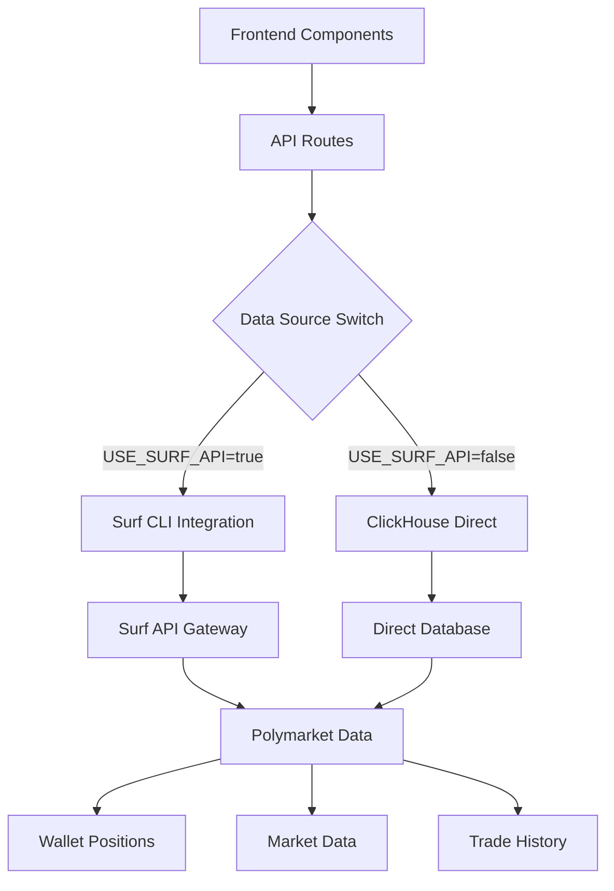

# Polymarket Wallets Analytics Platform

A comprehensive, enterprise-grade analytics platform for Polymarket wallet tracking, position analysis, and smart money insights. Features dual data source architecture (Surf CLI + ClickHouse), AI-powered analytics, and real-time position monitoring.

> **🎯 Perfect for:** Traders, researchers, fund managers, and developers building DeFi analytics applications.

## 🌟 Key Features

- **🔍 Advanced Wallet Analytics** - Deep dive into any Polymarket wallet's complete trading history
- **📊 Real-time Position Tracking** - Live P&L, open positions, and risk metrics
- **🤖 Smart Money Identification** - AI-powered detection of high-performing traders
- **📈 Market Intelligence** - Advanced market filtering, search, and trend analysis
- **💬 AI Chat Interface** - Ask natural language questions about wallets and markets
- **⚡ Dual Data Sources** - Switch seamlessly between Surf CLI and ClickHouse
- **📱 Responsive Design** - Optimized for desktop, tablet, and mobile

---

## 🚀 Quick Start (5 Minutes)

### Prerequisites
- **Node.js 18+**
- **Surf API Key** - Get yours at [agents.asksurf.ai](https://agents.asksurf.ai)

### Automated Setup (Recommended)
```bash
# 1. Clone and install
git clone <repo-url>
cd polymarket-wallets
npm install

# 2. One-click setup with Surf CLI
./scripts/setup-surf.sh

# 3. Start development
npm run dev
```

### Manual Setup
```bash
# 1. Configure environment
cp .env.example .env.local

# Add to .env.local:
SURF_API_KEY=your_api_key_here
USE_SURF_API=true

# 2. Install surf CLI
curl -fsSL https://agent.asksurf.ai/cli/releases/install.sh | sh
surf login

# 3. Start development
npm run dev
```

Visit [http://localhost:3000](http://localhost:3000) to explore wallets and markets!

---

## 🏗️ Complete Surf API Integration Guide

### Architecture Overview

This platform implements a **sophisticated dual-source architecture** that can seamlessly switch between Surf CLI (public API) and ClickHouse (direct database) for maximum flexibility:



### Core Surf API Integration

#### **1. Smart Data Source Switching**
```typescript
// src/app/api/markets/route.ts
const USE_SURF_API = process.env.SURF_API_KEY && process.env.USE_SURF_API === "true";

export async function GET(req: NextRequest) {
  const { searchParams } = req.nextUrl;
  const category = searchParams.get("category") || undefined;
  const limit = Math.min(parseInt(searchParams.get("limit") || "60"), 200);

  try {
    let markets;

    if (USE_SURF_API) {
      // Use Surf CLI for public API access
      const { getActiveMarkets } = await import("@/lib/queries/markets-surf");
      markets = await getActiveMarkets(category, limit, offset);
    } else {
      // Use ClickHouse for direct database access
      const { getActiveMarkets } = await import("@/lib/queries/markets");
      markets = await getActiveMarkets(category, limit, offset);
    }

    return NextResponse.json({
      data: markets,
      meta: {
        source: USE_SURF_API ? "surf-cli" : "clickhouse",
        count: markets.length,
        category: category || "all"
      }
    });
  } catch (error) {
    return NextResponse.json(
      { error: "Failed to fetch markets" },
      { status: 500 }
    );
  }
}
```

#### **2. Comprehensive Surf API Client**
```typescript
// src/lib/surf-api.ts
import { exec } from "child_process";
import { promisify } from "util";

const execAsync = promisify(exec);

interface SurfResponse<T> {
  data: T[];
  meta: {
    cached: boolean;
    credits_used: number;
    limit: number;
    offset: number;
  };
}

class SurfAPIClient {
  private rateLimiter = new Map<string, number>();

  async executeCommand<T>(command: string[]): Promise<SurfResponse<T> | null> {
    // Rate limiting (max 2 requests/second)
    await this.enforceRateLimit(command[0]);

    try {
      const { stdout, stderr } = await execAsync(`surf ${command.join(" ")}`);

      if (stderr && !stderr.includes("warning")) {
        throw new Error(`Surf CLI error: ${stderr}`);
      }

      return JSON.parse(stdout);
    } catch (error) {
      console.error(`Surf API error for command ${command[0]}:`, error);
      return null;
    }
  }

  private async enforceRateLimit(command: string): Promise<void> {
    const now = Date.now();
    const lastCall = this.rateLimiter.get(command) || 0;

    if (now - lastCall < 500) {
      await new Promise(resolve => setTimeout(resolve, 500));
    }

    this.rateLimiter.set(command, now);
  }
}

const surfClient = new SurfAPIClient();

// Market Data Functions
export async function getActiveMarketsViaSurf(
  category?: string,
  limit = 100,
  offset = 0
): Promise<any[]> {
  const response = await surfClient.executeCommand<any>([
    "search-prediction-market",
    "--limit", limit.toString()
  ]);

  if (!response?.data) return [];

  let markets = response.data;

  // Client-side category filtering
  if (category && category !== "All") {
    markets = markets.filter((market: any) =>
      market.category?.toLowerCase().includes(category.toLowerCase()) ||
      market.subcategory?.toLowerCase().includes(category.toLowerCase())
    );
  }

  // Manual pagination since surf CLI doesn't support offset
  return markets.slice(offset, offset + limit);
}

// Wallet Analysis Functions
export async function getWalletPositions(walletAddress: string): Promise<any[]> {
  const response = await surfClient.executeCommand<any>([
    "polymarket-positions",
    "--wallet-address", walletAddress
  ]);

  return response?.data || [];
}

export async function getWalletTradeHistory(
  walletAddress: string,
  limit = 100
): Promise<any[]> {
  // Note: This would require multiple calls to different markets
  // For now, we'll focus on position data
  const positions = await getWalletPositions(walletAddress);

  // Transform positions into trade-like format
  return positions.map(position => ({
    market_question: position.market?.question || "Unknown Market",
    condition_id: position.condition_id,
    outcome: position.outcome,
    shares: position.shares,
    avg_price: position.avg_price,
    current_price: position.current_price,
    unrealized_pnl: position.unrealized_pnl,
    timestamp: position.last_updated
  }));
}
```

#### **3. Advanced Market Analytics**
```typescript
// Market discovery and analysis
export async function searchMarketsViaSurf(query: string): Promise<any[]> {
  const response = await surfClient.executeCommand<any>([
    "search-prediction-market",
    "--limit", "100"
  ]);

  if (!response?.data) return [];

  // Client-side filtering since Surf CLI doesn't support text search yet
  const queryLower = query.toLowerCase();
  return response.data.filter((market: any) =>
    market.question?.toLowerCase().includes(queryLower) ||
    market.category?.toLowerCase().includes(queryLower) ||
    market.subcategory?.toLowerCase().includes(queryLower)
  );
}

// Get market price history for charts
export async function getMarketPriceHistory(
  conditionId: string,
  timeRange = "30d"
): Promise<any[]> {
  const response = await surfClient.executeCommand<any>([
    "polymarket-prices",
    "--condition-id", conditionId,
    "--limit", "100"
  ]);

  return response?.data || [];
}

// Cross-platform market matching
export async function getCrossPlatformMatches(): Promise<any[]> {
  const response = await surfClient.executeCommand<any>([
    "matching-market-pairs",
    "--limit", "50"
  ]);

  return response?.data || [];
}
```

### Advanced Wallet Analytics Implementation

#### **4. Smart Money Detection Algorithm**
```typescript
// src/lib/analytics/smart-money.ts
interface WalletMetrics {
  address: string;
  totalVolume: number;
  winRate: number;
  avgReturn: number;
  totalTrades: number;
  riskScore: number;
}

export async function identifySmartMoney(): Promise<WalletMetrics[]> {
  // Get leaderboard data from Polymarket
  const response = await surfClient.executeCommand<any>([
    "polymarket-leaderboard",
    "--limit", "100"
  ]);

  if (!response?.data) return [];

  // Calculate advanced metrics for each wallet
  const walletMetrics = await Promise.all(
    response.data.map(async (wallet: any) => {
      const positions = await getWalletPositions(wallet.address);

      return {
        address: wallet.address,
        totalVolume: wallet.total_volume || 0,
        winRate: calculateWinRate(positions),
        avgReturn: calculateAverageReturn(positions),
        totalTrades: positions.length,
        riskScore: calculateRiskScore(positions),
        sharpRatio: calculateSharpeRatio(positions)
      };
    })
  );

  // Sort by composite smart money score
  return walletMetrics.sort((a, b) =>
    calculateSmartMoneyScore(b) - calculateSmartMoneyScore(a)
  );
}

function calculateSmartMoneyScore(metrics: WalletMetrics): number {
  // Weighted scoring algorithm
  return (
    metrics.winRate * 0.3 +
    metrics.avgReturn * 0.3 +
    Math.log(metrics.totalVolume) * 0.2 +
    (1 / metrics.riskScore) * 0.2
  );
}
```

#### **5. Real-time Position Monitoring**
```typescript
// src/hooks/useWalletPositions.ts
export function useWalletPositions(walletAddress: string) {
  const [positions, setPositions] = useState([]);
  const [loading, setLoading] = useState(true);
  const [error, setError] = useState(null);

  useEffect(() => {
    let interval: NodeJS.Timeout;

    async function fetchPositions() {
      try {
        const response = await fetch(`/api/wallet/${walletAddress}/positions`);
        const data = await response.json();

        setPositions(data.positions);
        setError(null);
      } catch (err) {
        setError(err.message);
      } finally {
        setLoading(false);
      }
    }

    // Initial fetch
    fetchPositions();

    // Set up polling for real-time updates
    interval = setInterval(fetchPositions, 30000); // Update every 30 seconds

    return () => {
      if (interval) clearInterval(interval);
    };
  }, [walletAddress]);

  // Calculate derived metrics
  const totalValue = positions.reduce((sum, pos) => sum + pos.current_value, 0);
  const totalPnL = positions.reduce((sum, pos) => sum + pos.unrealized_pnl, 0);
  const winningPositions = positions.filter(pos => pos.unrealized_pnl > 0).length;
  const winRate = positions.length > 0 ? winningPositions / positions.length : 0;

  return {
    positions,
    loading,
    error,
    metrics: {
      totalValue,
      totalPnL,
      winRate,
      positionCount: positions.length
    }
  };
}
```

---

## 🎯 Building Advanced Features

### 1. AI-Powered Chat Interface

```typescript
// src/components/ai-chat.tsx
import { useState } from 'react';

export function AIChatInterface() {
  const [messages, setMessages] = useState([]);
  const [input, setInput] = useState('');
  const [loading, setLoading] = useState(false);

  const handleSubmit = async (e: React.FormEvent) => {
    e.preventDefault();
    if (!input.trim() || loading) return;

    const userMessage = input;
    setInput('');
    setLoading(true);

    // Add user message
    setMessages(prev => [...prev, { role: 'user', content: userMessage }]);

    try {
      // Send to AI endpoint with wallet/market context
      const response = await fetch('/api/ai/chat', {
        method: 'POST',
        headers: { 'Content-Type': 'application/json' },
        body: JSON.stringify({
          message: userMessage,
          context: 'polymarket-analytics' // Provides context for AI
        })
      });

      const data = await response.json();

      setMessages(prev => [...prev, {
        role: 'assistant',
        content: data.response
      }]);
    } catch (error) {
      setMessages(prev => [...prev, {
        role: 'assistant',
        content: 'Sorry, I encountered an error analyzing that request.'
      }]);
    } finally {
      setLoading(false);
    }
  };

  return (
    <div className="flex flex-col h-[600px] bg-white rounded-lg shadow">
      {/* Message history */}
      <div className="flex-1 overflow-y-auto p-4 space-y-4">
        {messages.map((message, i) => (
          <div key={i} className={`flex ${
            message.role === 'user' ? 'justify-end' : 'justify-start'
          }`}>
            <div className={`max-w-[80%] p-3 rounded-lg ${
              message.role === 'user'
                ? 'bg-blue-500 text-white'
                : 'bg-gray-100 text-gray-900'
            }`}>
              {message.content}
            </div>
          </div>
        ))}
        {loading && (
          <div className="flex justify-start">
            <div className="bg-gray-100 text-gray-900 p-3 rounded-lg">
              <div className="flex space-x-1">
                <div className="w-2 h-2 bg-gray-400 rounded-full animate-bounce"></div>
                <div className="w-2 h-2 bg-gray-400 rounded-full animate-bounce delay-100"></div>
                <div className="w-2 h-2 bg-gray-400 rounded-full animate-bounce delay-200"></div>
              </div>
            </div>
          </div>
        )}
      </div>

      {/* Input form */}
      <form onSubmit={handleSubmit} className="p-4 border-t">
        <div className="flex space-x-2">
          <input
            type="text"
            value={input}
            onChange={(e) => setInput(e.target.value)}
            placeholder="Ask about wallet performance, market trends, or trading strategies..."
            className="flex-1 px-3 py-2 border rounded-lg focus:outline-none focus:ring-2 focus:ring-blue-500"
            disabled={loading}
          />
          <button
            type="submit"
            disabled={loading || !input.trim()}
            className="px-4 py-2 bg-blue-500 text-white rounded-lg hover:bg-blue-600 disabled:opacity-50"
          >
            Send
          </button>
        </div>
      </form>
    </div>
  );
}
```

### 2. Advanced Market Filtering System

```typescript
// src/components/market-filters.tsx
interface FilterState {
  category: string;
  minVolume: number;
  maxVolume: number;
  priceRange: [number, number];
  timeToResolution: string;
  platform: 'all' | 'polymarket' | 'kalshi';
}

export function AdvancedMarketFilters({ onFiltersChange }: {
  onFiltersChange: (filters: FilterState) => void;
}) {
  const [filters, setFilters] = useState<FilterState>({
    category: 'all',
    minVolume: 0,
    maxVolume: 1000000000,
    priceRange: [0, 1],
    timeToResolution: 'all',
    platform: 'all'
  });

  const categories = [
    'All', 'Politics', 'Sports', 'Economics', 'Crypto', 'Entertainment'
  ];

  const timeRanges = [
    { label: 'All', value: 'all' },
    { label: 'Next 24h', value: '1d' },
    { label: 'Next Week', value: '7d' },
    { label: 'Next Month', value: '30d' },
    { label: 'Long Term', value: '90d+' }
  ];

  const updateFilter = (key: keyof FilterState, value: any) => {
    const newFilters = { ...filters, [key]: value };
    setFilters(newFilters);
    onFiltersChange(newFilters);
  };

  return (
    <div className="bg-white p-6 rounded-lg shadow space-y-6">
      <h3 className="text-lg font-semibold">Market Filters</h3>

      {/* Category Filter */}
      <div>
        <label className="block text-sm font-medium mb-2">Category</label>
        <select
          value={filters.category}
          onChange={(e) => updateFilter('category', e.target.value)}
          className="w-full px-3 py-2 border rounded-lg"
        >
          {categories.map(cat => (
            <option key={cat} value={cat.toLowerCase()}>
              {cat}
            </option>
          ))}
        </select>
      </div>

      {/* Volume Range */}
      <div>
        <label className="block text-sm font-medium mb-2">
          Volume Range: ${filters.minVolume.toLocaleString()} - ${filters.maxVolume.toLocaleString()}
        </label>
        <div className="space-y-2">
          <input
            type="range"
            min="0"
            max="1000000000"
            step="1000000"
            value={filters.minVolume}
            onChange={(e) => updateFilter('minVolume', parseInt(e.target.value))}
            className="w-full"
          />
          <input
            type="range"
            min="0"
            max="1000000000"
            step="1000000"
            value={filters.maxVolume}
            onChange={(e) => updateFilter('maxVolume', parseInt(e.target.value))}
            className="w-full"
          />
        </div>
      </div>

      {/* Price Range */}
      <div>
        <label className="block text-sm font-medium mb-2">
          Price Range: {(filters.priceRange[0] * 100).toFixed(0)}% - {(filters.priceRange[1] * 100).toFixed(0)}%
        </label>
        <div className="px-2">
          <input
            type="range"
            min="0"
            max="1"
            step="0.01"
            value={filters.priceRange[0]}
            onChange={(e) => updateFilter('priceRange', [parseFloat(e.target.value), filters.priceRange[1]])}
            className="w-full"
          />
        </div>
      </div>

      {/* Platform Filter */}
      <div>
        <label className="block text-sm font-medium mb-2">Platform</label>
        <div className="flex space-x-4">
          {['all', 'polymarket', 'kalshi'].map(platform => (
            <label key={platform} className="flex items-center">
              <input
                type="radio"
                name="platform"
                value={platform}
                checked={filters.platform === platform}
                onChange={(e) => updateFilter('platform', e.target.value)}
                className="mr-2"
              />
              {platform.charAt(0).toUpperCase() + platform.slice(1)}
            </label>
          ))}
        </div>
      </div>

      {/* Time to Resolution */}
      <div>
        <label className="block text-sm font-medium mb-2">Time to Resolution</label>
        <select
          value={filters.timeToResolution}
          onChange={(e) => updateFilter('timeToResolution', e.target.value)}
          className="w-full px-3 py-2 border rounded-lg"
        >
          {timeRanges.map(range => (
            <option key={range.value} value={range.value}>
              {range.label}
            </option>
          ))}
        </select>
      </div>

      {/* Reset Filters */}
      <button
        onClick={() => {
          const defaultFilters: FilterState = {
            category: 'all',
            minVolume: 0,
            maxVolume: 1000000000,
            priceRange: [0, 1],
            timeToResolution: 'all',
            platform: 'all'
          };
          setFilters(defaultFilters);
          onFiltersChange(defaultFilters);
        }}
        className="w-full px-4 py-2 bg-gray-500 text-white rounded-lg hover:bg-gray-600"
      >
        Reset Filters
      </button>
    </div>
  );
}
```

---

## 📊 Data Source Comparison

### Surf CLI vs ClickHouse

| Feature | Surf CLI | ClickHouse |
|---------|----------|------------|
| **Setup Complexity** | ✅ Simple (API key only) | ❌ Complex (DB credentials, network access) |
| **Data Freshness** | ✅ Real-time (30 min refresh) | ⚠️ Cached (varies) |
| **Rate Limits** | ✅ Managed automatically | ✅ No limits |
| **Cost** | ⚠️ Credit-based | ✅ Free (if you have access) |
| **Reliability** | ✅ High uptime | ⚠️ Depends on infrastructure |
| **Open Source Ready** | ✅ Public API | ❌ Requires private credentials |
| **Query Flexibility** | ⚠️ Fixed endpoints | ✅ Custom SQL |
| **Historical Data** | ✅ 30+ days | ✅ Full history |
| **Wallet Positions** | ✅ Live API | ✅ Database queries |

### When to Use Each

**Choose Surf CLI when:**
- Building open source applications
- Want simple setup and maintenance
- Need real-time data
- Building for production deployment
- Want managed rate limiting

**Choose ClickHouse when:**
- Need custom queries and analytics
- Have database access credentials
- Building internal tools
- Need full historical data
- Want maximum query flexibility

---

## 🚀 Deployment Architecture

### Production Environment Setup

```bash
# Environment variables for production
SURF_API_KEY=sk-your-production-key
USE_SURF_API=true
XAI_API_KEY=xai-your-key
NODE_ENV=production
NEXTAUTH_SECRET=your-nextauth-secret
```

### Vercel Deployment (Recommended)

```bash
# Deploy to Vercel
vercel --prod

# Set environment variables
vercel env add SURF_API_KEY
vercel env add USE_SURF_API true
vercel env add XAI_API_KEY
```

### Docker Deployment

```dockerfile
# Dockerfile
FROM node:18-alpine

WORKDIR /app

# Install dependencies
COPY package*.json ./
RUN npm ci --only=production

# Copy source code
COPY . .

# Build application
RUN npm run build

# Expose port
EXPOSE 3000

# Start application
CMD ["npm", "start"]
```

---

## 🔧 Advanced Configuration

### Rate Limiting Configuration
```typescript
// src/lib/rate-limiter.ts
export class RateLimiter {
  private requests: Map<string, number[]> = new Map();

  constructor(
    private maxRequests = 120, // requests
    private timeWindow = 60000  // per minute
  ) {}

  async checkLimit(identifier: string): Promise<boolean> {
    const now = Date.now();
    const requests = this.requests.get(identifier) || [];

    // Clean old requests
    const validRequests = requests.filter(time => now - time < this.timeWindow);

    if (validRequests.length >= this.maxRequests) {
      return false; // Rate limit exceeded
    }

    // Add current request
    validRequests.push(now);
    this.requests.set(identifier, validRequests);

    return true;
  }
}
```

### Caching Strategy
```typescript
// src/lib/cache.ts
export class DataCache {
  private cache = new Map<string, { data: any; timestamp: number; ttl: number }>();

  set(key: string, data: any, ttl = 300000): void { // 5 min default TTL
    this.cache.set(key, {
      data,
      timestamp: Date.now(),
      ttl
    });
  }

  get(key: string): any | null {
    const cached = this.cache.get(key);

    if (!cached) return null;

    if (Date.now() - cached.timestamp > cached.ttl) {
      this.cache.delete(key);
      return null;
    }

    return cached.data;
  }

  clear(): void {
    this.cache.clear();
  }
}
```

---

## 📈 Performance Optimization

### Optimized Data Fetching
```typescript
// src/lib/optimized-fetching.ts
export async function optimizedMarketFetch(filters: any) {
  // 1. Check cache first
  const cacheKey = `markets-${JSON.stringify(filters)}`;
  const cached = cache.get(cacheKey);
  if (cached) return cached;

  // 2. Batch multiple requests
  const [markets, analytics, correlations] = await Promise.all([
    getActiveMarketsViaSurf(filters.category, filters.limit),
    getMarketAnalytics(),
    getCrossPlatformMatches()
  ]);

  // 3. Process and enrich data
  const enrichedMarkets = markets.map(market => ({
    ...market,
    analytics: analytics.find(a => a.condition_id === market.condition_id),
    crossPlatformMatch: correlations.find(c => c.condition_id === market.condition_id)
  }));

  // 4. Cache results
  cache.set(cacheKey, enrichedMarkets, 300000); // 5 min TTL

  return enrichedMarkets;
}
```

---

## 🤝 Contributing & Development

### Development Workflow
1. **Fork repository**
2. **Create feature branch**: `git checkout -b feature/wallet-analytics`
3. **Install dependencies**: `npm install`
4. **Set up environment**: Copy `.env.example` to `.env.local`
5. **Start development**: `npm run dev`
6. **Run tests**: `npm run test`
7. **Submit PR**

### Code Style Guidelines
- Use TypeScript strict mode
- Follow ESLint/Prettier configuration
- Write tests for new features
- Update documentation for API changes
- Ensure mobile responsiveness

---

## 📚 API Documentation

### Complete Surf Commands Used

```bash
# Core market data
surf search-prediction-market --limit 100
surf polymarket-markets --market-slug "slug"
surf polymarket-prices --condition-id "0x..."
surf polymarket-trades --condition-id "0x..."

# Wallet analysis
surf polymarket-positions --wallet-address "0x..."
surf polymarket-leaderboard --limit 100

# Analytics
surf prediction-market-analytics
surf prediction-market-correlations --limit 50
surf matching-market-pairs --limit 50
```

### Error Handling Patterns
```typescript
try {
  const data = await surfClient.executeCommand(command);
  return data?.data || [];
} catch (error) {
  console.error(`Surf API error:`, error);
  // Fallback to cached data or empty response
  return cache.get(cacheKey) || [];
}
```

---

## 🆘 Troubleshooting

### Common Issues

**Surf CLI Connection Failed**
```bash
# Check API key
echo $SURF_API_KEY

# Re-authenticate
surf login

# Test connection
surf search-prediction-market --limit 1
```

**Rate Limit Exceeded**
- Implement request queuing
- Add delays between requests
- Consider caching responses
- Upgrade API plan if needed

**Missing Wallet Data**
- Verify wallet address format
- Check if wallet has Polymarket activity
- Ensure API key has required permissions

---

## 📄 License

MIT License - see [LICENSE](LICENSE) for details.

---

## 🔗 Resources

- [Surf API Documentation](https://docs.asksurf.ai)
- [Polymarket API](https://docs.polymarket.com)
- [Next.js Documentation](https://nextjs.org/docs)
- [TypeScript Guidelines](https://typescript-eslint.io/docs/)

**Built with ❤️ using Surf API, Next.js, and TypeScript**